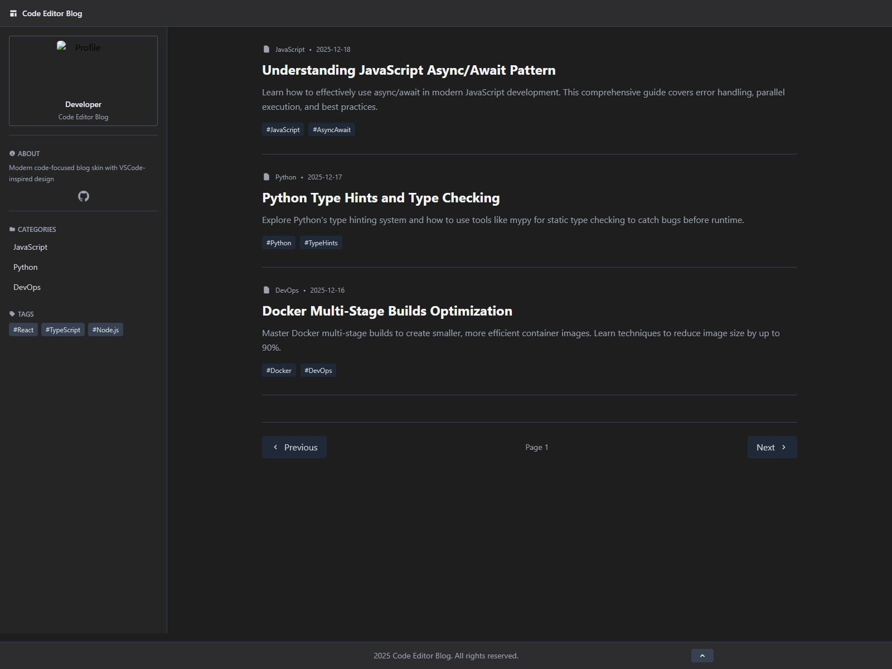

# Code Editor Blog - 티스토리 커스텀 스킨

Cursor AI 에디터 스타일의 모던한 기술 블로그 티스토리 스킨입니다.

## 미리보기



## 특징

- **에디터 테마 디자인**: VS Code / Cursor AI 스타일의 다크 UI
- **사이드바 파일 트리**: 카테고리를 파일 탐색기처럼 표시
- **다크 / 라이트 모드**: 토글 버튼으로 즉시 전환, `localStorage`에 설정 저장
- **목차 자동 생성 (TOC)**: 글 본문의 H2, H3 제목에서 자동으로 목차를 생성
- **반응형 레이아웃**: 모바일 / 태블릿 / 데스크톱 대응
- **SEO 최적화**: Open Graph, Twitter Card, 메타 태그 완비
- **이미지 지연 로딩**: 페이지 성능 향상
- **폰트**: JetBrains Mono (코드 전용 모노스페이스)

## 파일 구조

```
CustomSkin/
├── skin.html        # 메인 HTML 템플릿 (티스토리 치환자 포함)
├── style.css        # 커스텀 스타일시트
├── script.js        # 인터랙션 스크립트
├── index.xml        # 스킨 메타데이터 및 설정 변수
├── preview.html     # 스킨 미리보기 페이지
├── preview256.jpg   # 썸네일 (256px)
├── preview560.jpg   # 썸네일 (560px)
└── preview1600.jpg  # 썸네일 (1600px)
```

## 커스터마이징

티스토리 관리자 > 꾸미기 > 스킨 편집 > **설정** 탭에서 아래 항목을 변경할 수 있습니다.

### 외관 설정

| 항목 | 설명 | 기본값 |
|------|------|--------|
| 메인 강조 색상 | 링크, 버튼 등의 메인 색상 | `#007acc` |
| 사이드바 배경 색상 | 왼쪽 사이드바 배경 | `#252526` |
| 메인 배경 색상 | 글 목록/본문 영역 배경 | `#1e1e1e` |
| 텍스트 색상 | 본문 기본 텍스트 색상 | `#d4d4d4` |

### 레이아웃 설정

| 항목 | 옵션 | 기본값 |
|------|------|--------|
| 사이드바 너비 | 200px / 250px / 300px | `300px` |
| 라이트 모드 토글 버튼 | 표시 / 숨김 | `true` |

### 기능 설정

| 항목 | 설명 | 기본값 |
|------|------|--------|
| 검색 기능 | 상단 검색창 표시 여부 | `true` |
| 목차 자동 생성 | 글 상세 페이지에서 TOC 생성 | `true` |
| 이미지 지연 로딩 | 이미지 lazy load 적용 | `true` |

### 폰트 설정

코드 블록에 사용할 모노스페이스 폰트 선택:
- JetBrains Mono (기본)
- Fira Code
- Consolas
- Monaco

## 소셜 링크 수정

`skin.html` 내 About 섹션에서 GitHub, 이메일 주소를 직접 수정하세요.

```html
<a href="https://github.com/YOUR_USERNAME" ...>GitHub</a>
<a href="mailto:YOUR_EMAIL@example.com" ...>Email</a>
```

## 기술 스택

- **Tailwind CSS** (CDN) — 유틸리티 우선 CSS 프레임워크
- **JetBrains Mono** (Google Fonts) — 코드 폰트
- **Vanilla JS** — 외부 라이브러리 없이 순수 JavaScript

## 라이선스

MIT License
